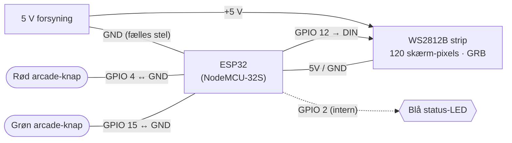

# Hardware – Gamebox

Stykliste og wirediagram for **gameboxen** (den store LED-strip-enhed der afvikler spillene).

> Board: klassisk **ESP32** (`esp32:esp32:esp32`, default-partition, 4 MB flash) – fx NodeMCU-32S.
> Pins herunder er dem firmwaren **faktisk** bruger i den trådløse (ESP-NOW) udgave.
> Joystick-input kommer trådløst via ESP-NOW – der er derfor **ingen** kablede knap-/lyd-pins på gameboxen.

---

## Stykliste

| Antal | Komponent | Detalje |
|:---:|---|---|
| 1 | ESP32 udviklingsboard | NodeMCU-32S / generisk ESP32, 4 MB flash |
| 1 | WS2812B LED-strip | Adresserbar, farverækkefølge **GRB**. 120 pixels vises på skærmen (firmware-default `NUM_LEDS` = 138 inkl. reserve) |
| 1 | Arcade-trykknap **RØD** | Momentan, sluttende (NO) |
| 1 | Arcade-trykknap **GRØN** | Momentan, sluttende (NO) |
| 1 | 5 V strømforsyning | Til LED-strippen – se note om dimensionering |
| — | Onboard blå LED (GPIO 2) | Status – sidder på boardet, ingen ekstra ledning |

**Anbefalet for WS2812B (ikke i koden, men god praksis):**

| Antal | Komponent | Formål |
|:---:|---|---|
| 1 | Kondensator ~1000 µF (6.3 V+) | Over strippens +5V/GND ved indgangen (buffer mod strømspidser) |

> Dataledningen går **direkte** fra GPIO 12 til strippens DIN (3.3 V) – i denne opbygning bruges hverken serie-modstand eller 3.3→5 V level shifter.

> **Strømdimensionering:** WS2812B trækker op til ~60 mA/pixel ved fuld hvid. 138 pixels ≈ 8 A worst-case; i praksis bruger spillene langt mindre. Vælg en 5 V-forsyning med god margin, og **strømforsyn strippen direkte** – ikke gennem ESP'ens 5V-pin.

---

## Wiring (pin-oversigt)

| ESP32-pin | Forbindes til | Note |
|---|---|---|
| **GPIO 12** | LED-strip **DIN** | Data-signal (3.3 V, direkte) |
| **5V / VIN** | LED-strip **+5V** | Fra ekstern 5 V-forsyning (fælles) |
| **GND** | LED-strip **GND** + forsyningens GND | **Fælles stel** – vigtigt |
| **GPIO 4** | **Rød** knap → GND | `INPUT_PULLUP`, aktiv-lav |
| **GPIO 15** | **Grøn** knap → GND | `INPUT_PULLUP`, aktiv-lav |
| **GPIO 2** | Onboard blå status-LED | Intern på boardet |

Hver knap forbindes mellem sin GPIO og **GND**. Den interne pull-up gør benet højt i hvile; et tryk trækker det lavt.

---

## Wirediagram

---

## Boot-tilstande (fysiske knapper ved opstart)

| Knapper holdt | Tilstand |
|---|---|
| Ingen | Spil-mode – kun ESP-NOW, hurtig boot |
| Grøn | WiFi-mode – forbinder til router + web-admin |
| Rød + Grøn | Config-AP `GameboxSetup` (åbn `192.168.4.1`) |

Under spil: **rød** = skift spil (lobby) / afbryd (i spil), **grøn** = start runde, **rød holdt 3 sek.** = screensaver.

---

*Pins kan ændres i web-adminen / `Gamebox/config_manager.h`. Komponenter markeret "anbefalet" er ikke fastlagt i koden – tilpas efter din egen opbygning.*
