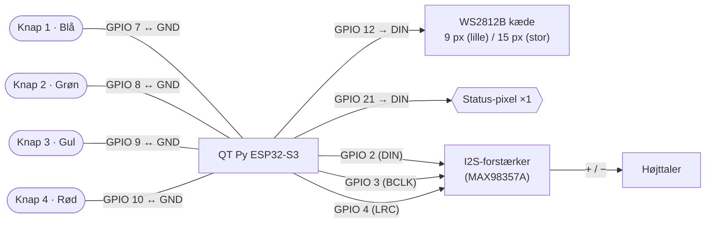

# Hardware – Joystick

Stykliste og wirediagram for de **trådløse joysticks** (ét pr. hold).

> Board: **Adafruit QT Py ESP32-S3 (N4R2)** – 4 MB flash, 2 MB PSRAM
> (`esp32:esp32:adafruit_qtpy_esp32s3_n4r2`, `huge_app`-partition).
> ESP32-S3 er valgt fordi GPIO 7-10 bruges til knapper – de er optaget af flash på en klassisk ESP32-WROOM.

Der findes **to varianter** (vælges pr. joystick i gameboxens web-admin, `JoystickType`):

| Type | Knapper | Lyd |
|:---:|---|:---:|
| **0** – lille | 4 (Blå · Grøn · Gul · Rød) | ✅ ja |
| **1** – stor | op til 11 (P1–P11) | ❌ nej |

Firmwaren er den samme; forskellen er antal knapper (`BtnCount`) og om lyd er slået til (`HasAudio`).

---

## Stykliste (lille joystick – 4 knapper + lyd, default)

| Antal | Komponent | Detalje |
|:---:|---|---|
| 1 | Adafruit QT Py ESP32-S3 (N4R2) | 4 MB flash, 2 MB PSRAM, USB-C |
| 4 | Arcade-trykknapper | Blå, Grøn, Gul, Rød – momentan (NO) |
| 1 | WS2812B LED-kæde, **9 pixels** | Knap-/score-lys, farverækkefølge RGB (stor model: 15 pixels) |
| 1 | WS2812B status-pixel, **1 stk** | Enkelt NeoPixel (GRB) |
| 1 | I2S-forstærker | Klasse-D med I2S-indgang, fx **MAX98357A** |
| 1 | Højttaler | Lille 4–8 Ω |
| 1 | Elektrolyt-kondensator **100 µF** | Over +5V/GND – buffer |
| 1 | Keramisk kondensator **100 nF** (orange) | På tværs af forsyningen – dæmper støj |
| 1 | Strømforsyning | USB-C eller batteri (dvale/deep-sleep understøttes) |

> **Stor joystick (Type 1):** samme board og status-pixel, men **15-pixels** LED-kæde, **op til 11 knapper** og **ingen** forstærker/højttaler (`HasAudio = false`). Ekstra knapper (P5–P11) tildeles GPIO'er i web-adminen.
>
> Firmwaren driver op til 15 pixels (`LED_COUNT`); på den lille model er kun de første **9** monteret.

---

## Wiring (pin-oversigt)

| QT Py ESP32-S3 pin | Forbindes til | Note |
|---|---|---|
| **GPIO 7** | Knap 1 – **Blå** → GND | `INPUT_PULLUP`, aktiv-lav |
| **GPIO 8** | Knap 2 – **Grøn** → GND | `INPUT_PULLUP`, aktiv-lav |
| **GPIO 9** | Knap 3 – **Gul** → GND | `INPUT_PULLUP`, aktiv-lav |
| **GPIO 10** | Knap 4 – **Rød** → GND | `INPUT_PULLUP`, aktiv-lav |
| *(vælges i web-UI)* | Knap 5–11 (kun stor model, P5–P11) | Ledige GPIO'er |
| **GPIO 12** | LED-kæde **DIN** (15 pixels) | Spil-/score-lys |
| **GPIO 21** | Status-pixel **DIN** (1 stk) | |
| **GPIO 2** | I2S **DIN** (forstærkerens data-ind) | Kun med lyd |
| **GPIO 3** | I2S **BCLK** (bit-clock) | Kun med lyd |
| **GPIO 4** | I2S **LRC / WS** (word-select) | Kun med lyd |
| **5V** | Forstærker Vin + LED +5V | |
| **GND** | Fælles stel (knapper, LED, forstærker) | |

Knapperne sidder mellem GPIO og **GND** (intern pull-up, aktiv-lav). Knap 1–4 vækker også boardet fra dvale.
Forstærkerens `SD`/`GAIN` sættes efter dens eget datablad (fx `GAIN` uforbundet = 9 dB).

---

## Wirediagram

---

## Config-mode

Hold **knap 1 + knap 2** nede ved opstart → joysticket starter access point `JoystickSetup` (åbn `192.168.4.1` for at sætte navn, kanal, gamebox-MAC, antal knapper, lyd m.m.).

---

*Knapfarverne følger kappen; firmwaren sender kun knap-indeks (1–4). Forstærker-model (MAX98357A) er ikke fastlagt i koden – enhver I2S-klasse-D-forstærker med BCLK/LRC/DIN passer til pin-opsætningen.*
